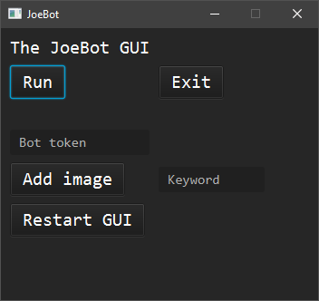

# JoeBot
Upcoming version of my old discord bot with more features in the future.
Currently has a functioning GUI that can run and stop the bot at will, including terminating the bot when the window is closed (not minimized). 

In other words, theres no need for the bot to run from the IDE; it can now be turned on from a standalone .jar file.

**Ver 1.0 8/5/20:** Added perhaps the hardest thing, but the most anticipated feature I've wanted for a very long time: the ability to upload files through the bot and automatically rename and categorize images in .png format.

**Ver 1.1 8/13/20:** Added a small, but helpful thing, where the bot is able to save preferences (currently only the directory and token) into a basic text file. Reduces the irritable process of having to copy and paste the token every time the bot is turned on. Same applies of having to select a directory.

**Ver 1.2 8/16/20:** Fixed minor issue where the bot would not read from preferences file upon startup.

**Ver 1.3 8/17/20:** Added the ability for the bot to bulk-mass delete messages from a single command. How many messages to be deleted can be determined from the user. (I have it set to delete ONLY if the message comes from the bot or the user that issued the command).

**Ver 1.4 8/18/20:** Added the thing I've been dreaming of in my head: Bot is now able to not only add images from the GUI and automatially name them depending on keyword, but it is also able to scan and retrieve images that fall under the same name keyword taken from the user, determining which random image will be sent into the server.

**Ver 1.5 8/18/20:** Added two things: 1) A help menu to display commands and how to use the bot. 2) Dynamically change which image commands are available for use, depending on real-time changes in the selected images folder.

*Why is it called JoeBot? Dunno, just an ongoing joke among my friends.*
